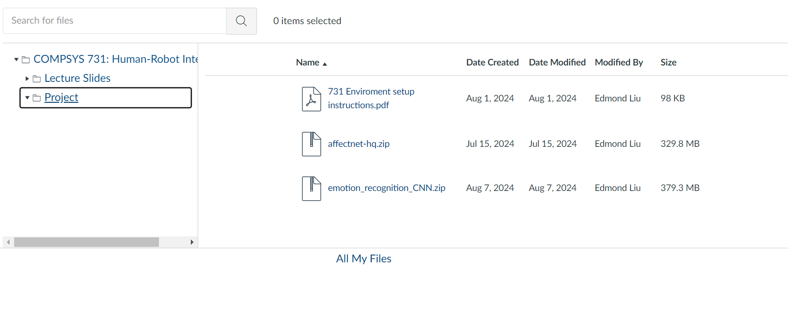

This repository is for a ChatGPT chatbot which pretends to be a Westfield Mall, St Lukes, New Zealand Information Kiosk chatbot.
The chatbot is able to pretend to provide information about the mall, such as the location of stores, opening hours, and other general information.
There is a GUI interface for the chatbot, which allows the user to interact with the chatbot in a more user-friendly way.
We've trained a machine learning model to detect emotions from a camera pointed at the user.
it uses YOLOv8 to detect the user's face and then uses the model to detect the user's emotions.
The user's emotions are passed to ChatGPT to provide a more tailored response.

Since this is a Python project, you will need to do some setup before you can run the application.

Before downloading the files, setup the python intepreter from the document "731 Environment setup instructions" which can be found in the provided screenshot:
NOTE: We used a different Pytorch version for compatility. Use this command instead:
conda install pytorch torchvision torchaudio pytorch-cuda=12.1 -c pytorch -c nvidia


Ensure the Cuda files are installed in your .....path....\anaconda\envs\cs731\Library\ bin, include and lib locations.
If not try manually download and add from https://developer.nvidia.com/cudnn-downloads
We have used the following version for compatilibity reasons:
cudnn-windows-x86_64-8.9.7.29_cuda12-archive

To run the application run the following commands:
```python
pip install -r requirements.txt # installs dependencies
python main.py
```

Note: ensure your root directory is the root of the repository in order to run the commands mentioned above.
Note: In order for the application to access OpenAI, an API key is required. Please email us so we can send the API key to the marker

If you want to add your own images, you can run the auto_splitter.py code to help you get your files into the correct folders.
Change the file paths in the code to the location of your images and desired output folders.
To run it you need an import of the following additional library:
pip install scikit-learn